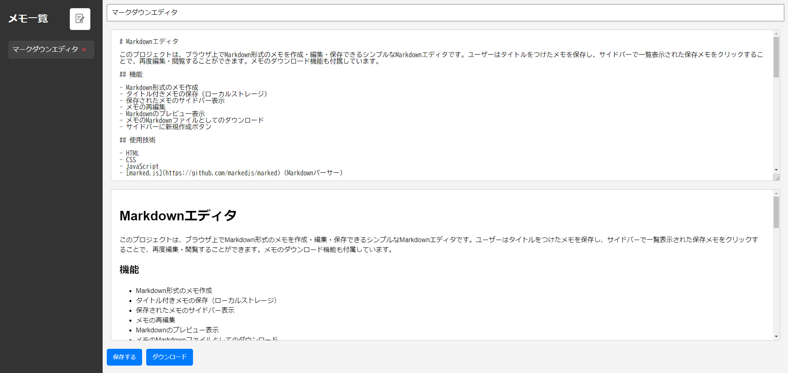

# Markdownエディタ

このプロジェクトは、ブラウザ上でMarkdown形式のメモを作成・編集・保存できるシンプルなMarkdownエディタです。ユーザーはタイトルをつけたメモを保存し、サイドバーで一覧表示された保存メモをクリックすることで、再度編集・閲覧することができます。メモのダウンロード機能も付属しています。

## デモ


## 機能

- Markdown形式のメモ作成
- タイトル付きメモの保存（ローカルストレージ）
- 保存されたメモのサイドバー表示
- メモの再編集
- Markdownのプレビュー表示
- メモのMarkdownファイルとしてのダウンロード
- サイドバーに新規作成ボタン

## 使用技術

- HTML
- CSS
- JavaScript
- [marked.js](https://github.com/markedjs/marked) (Markdownパーサー)
  

### メモの作成

1. エディタの上部にタイトルを入力します。
2. その下のエディタにMarkdown形式でテキストを入力します。
3. 右側に入力内容のリアルタイムプレビューが表示されます。

### メモの保存

1. 「保存する」ボタンをクリックすると、タイトルと内容がローカルストレージに保存されます。
2.  保存したメモは左側のサイドバーにタイトルが一覧表示され、クリックするとそのメモの内容が再度表示されます。

### メモのダウンロード

1. 「ダウンロード」ボタンをクリックすると、Markdownファイル形式でメモをダウンロードできます。

## ローカルストレージのデータ構造

- キー: `notes`
- 値: メモの配列がJSON形式で保存されます。各メモは次の形式で保存されています：

    ```json
    [
        {
            "title": "メモのタイトル1",
            "content": "# これはメモの内容です\nMarkdownで書かれています。"
        },
        {
            "title": "メモのタイトル2",
            "content": "## 別のメモの内容\nこちらもMarkdownです。"
        }
    ]
    ```

## 開発者向け

このアプリはローカル環境で動作するため、追加のサーバー設定は必要ありません。次のファイルで開発を進めることができます：

- `index.html`：HTML構造
- `styles.css`：スタイルシート
- `script.js`：JavaScriptファイル

## 注意事項
- 別のブラウザでメモを開くと、データが反映されません。
- 自動保存ではないため、保存ボタンを忘れないように
- タイトルが重複しているかどうかで上書き保存されるため、タイトルを変更すると新しく別のファイルとして保存されます。
### 使用できない表現
- 引用はインデントが下がるだけです。
- 斜体は全角文字で使えません。
  
## 今後の機能改善
### 全体
- ホバーメッセージ追加
- ダイアログのデザイン改良
- mdファイルをMDメモにアップロード

### 保存機能
- タイトルを変更すると別のものとして保存されてしまうため、idを付与する
- jsonファイルでの出力、jsonファイルの保存先の設定 → 検索機能を追加
- 保存せずに移動する場合、ポップアップの「はい」ボタンで保存し、移動
- ローカルストレージからのバックアップ・復元
- 別端末からでもアクセス可能

### サイドバー
- 折り畳み、マウスでのサイズ変更
- 目次
- 新規作成した際のアニメーション追加
- 保存したメモのグループ化・並べ替え

### エディター
- 左上にコピーボタンを追加
- 文字の色指定
